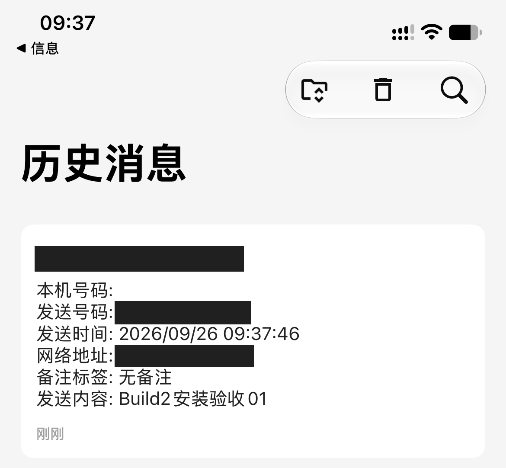

# 用 Bark 接收设备短信通知

适用于固件提供 Bark 通道的短信转发设备与 iPhone。设备负责推送，Mac 助手用于查看结果。以下根据本次设备配置记录独立整理，配图使用本项目已脱敏素材；不同固件的字段可能不同。

## 准备

1. 从 [Bark 官方项目](https://github.com/Finb/Bark)提供的入口安装 iPhone 应用，允许通知。
2. 在 Bark 内取得自己的推送地址。官方说明支持复制测试 URL 并请求它来验证通知；先按 Bark 当前界面完成自身测试。
3. 确认设备已插入可收短信的 SIM 卡、接入网络，并能打开设备说明书指定的管理页面。不要照抄别人的局域网地址或密码。

## 填写设备通道

1. 在设备管理后台找到推送通道，选择 Bark。
2. 根据字段填写自己的参数：要求“推送地址”时填固件要求的地址；要求“Key”时只填 Key。Bark 的完整测试 URL 可能带有测试正文，不能不看字段就整段粘贴。字段含义不清时先核对设备说明书，不猜格式。
3. 保存配置，确认设备网络状态已连接。

上图只示意入口。推送地址相当于发送通知的凭据，不要放进反馈截图。本文不提供任何可直接使用的真实 Key。

## 验证真正收到

1. 在手机短信应用中，向设备 SIM 卡号码发送“Bark 配置测试 01”。
2. 在 Bark 查看是否收到同一条正文。若仅未弹出横幅，也查看通知权限、专注模式及应用内记录。
3. 需要排查时，用 USB 将设备接到 Mac，按[快速上手](../快速上手.md)连接，再发送新短信。对照短信卡片、推送日志详情和 Bark 实际消息。
4. 记录是否成功；保存配置不等于推送成功，日志 HTTP 200 也不等于手机已收到。

本次 Build 2 安装副本与 Bark 对照证据：

这是既有设备实测证据，不是此次文档修改后重新测试，也不代表所有固件兼容。

## 没收到时

- Bark 自身测试也收不到：先排查 Bark 服务、iPhone 通知权限及网络。
- Bark 自身测试正常，设备不推送：核对设备网络、通道是否启用、字段格式和保存结果。
- Mac 有短信卡片但无推送结果：展开日志详情，在设备后台排查该通道；助手不会代替设备发送通知。
- 反馈时提供型号、固件和脱敏错误截图，不提供完整推送 URL、Key 或原始 PDU。

来源：[Bark 官方使用说明](https://github.com/Finb/Bark#usage)，核对日期 2026/09/26；设备配置步骤来自本项目既有实测与脱敏截图。[返回渠道索引](推送渠道教程.md)。
