# 短信转发配置与验收：脱敏截图归档

这份归档用于教程配图和验收对照，不含原始日志、真实通知 Key 或原图。灰色色块为隐私遮盖，不是应用界面原本的内容。

处理日期：2026-09-25。全部 56 张配图见 [截图预览](截图预览.html)。

Bark 之外的配置入口见[推送渠道教程](推送渠道教程.md)，包含个人飞书副本链接及各渠道的实测状态。

## 设备通电

本次实际设备外观；铭牌区域已遮盖。

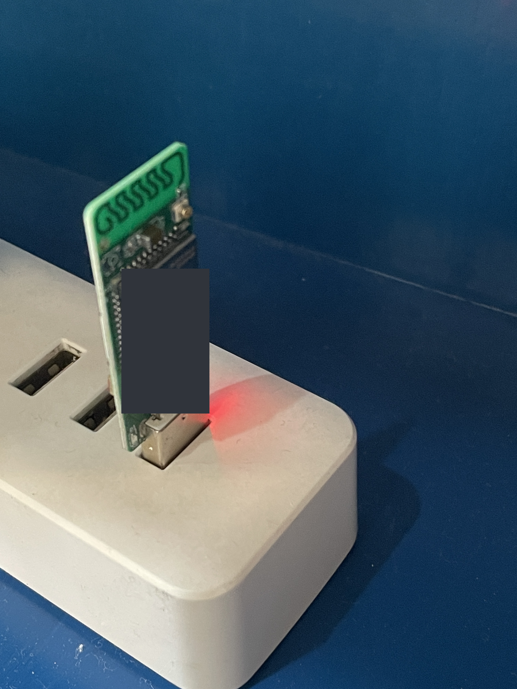

## 连接设备热点

选取设备对应热点。截图中设备热点及周边网络名称已遮盖，不代表这些名称为空。

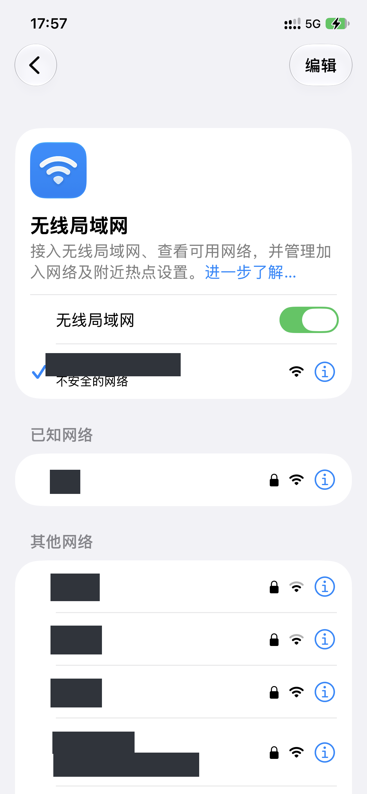

## 打开管理页面

在设备说明书指定的管理地址登录；截图中的地址已遮盖。

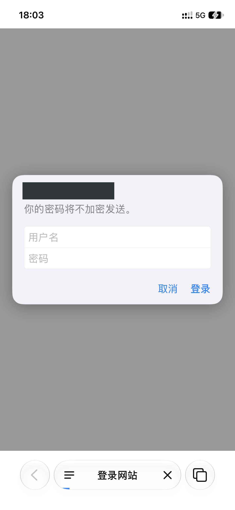

## 设置网络

填写自己的 Wi-Fi 名称和密码，不照抄截图中的配置。

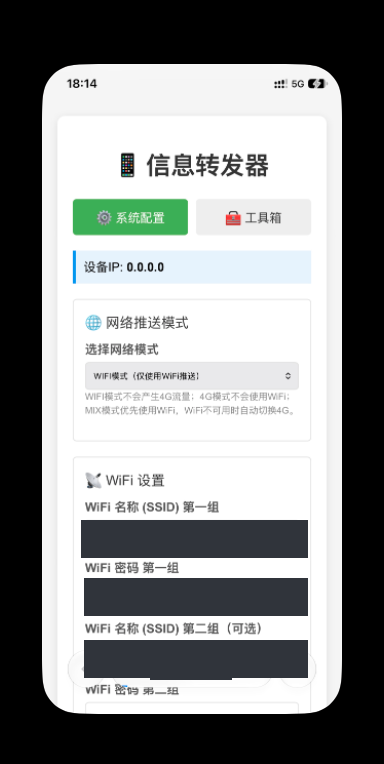

## 配置 Bark 通道

选择 Bark 渠道，填写你自己的推送地址。此图处于地址尚未填写的步骤，没有展示真实 Bark Key。

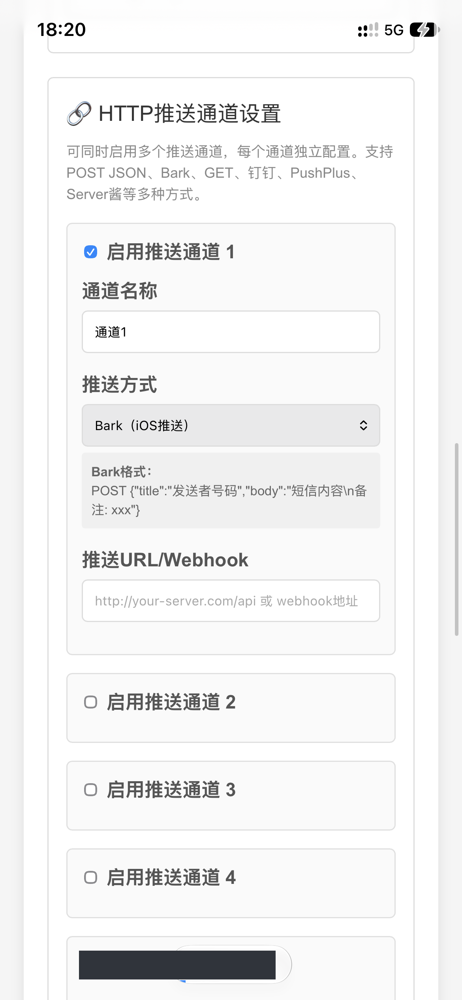

## 保存配置

保存成功只证明配置已提交；还需验证联网和推送。

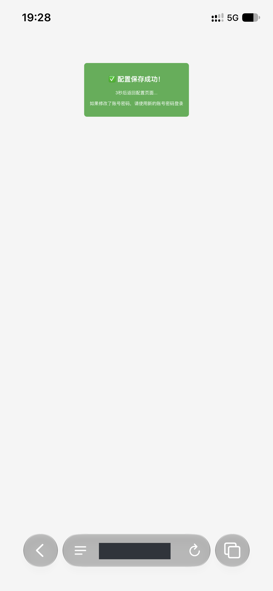

## 确认 Wi-Fi 状态

本次截图显示已连接；SSID、IP、MAC 和 BSSID 等已遮盖。

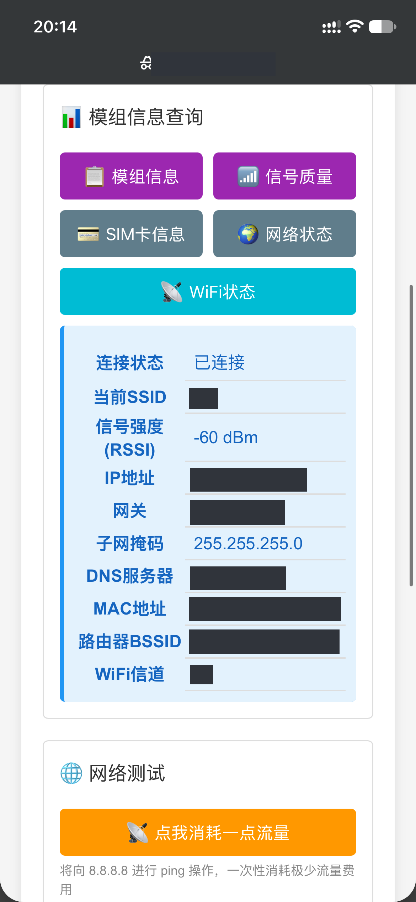

## 普通短信与来电提醒

本次普通短信推送成功。来电提醒见下图，提醒不等于已判定未接来电。

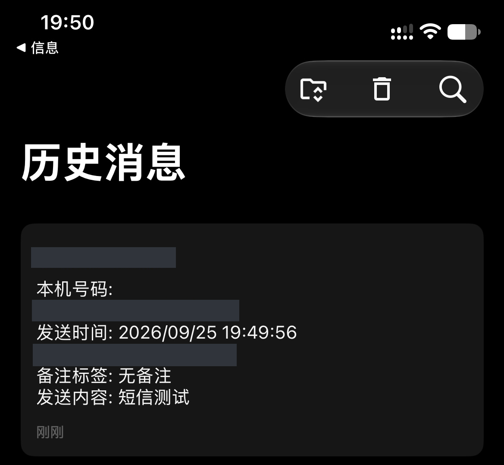

## 来电提醒

来电号码已整体遮盖。

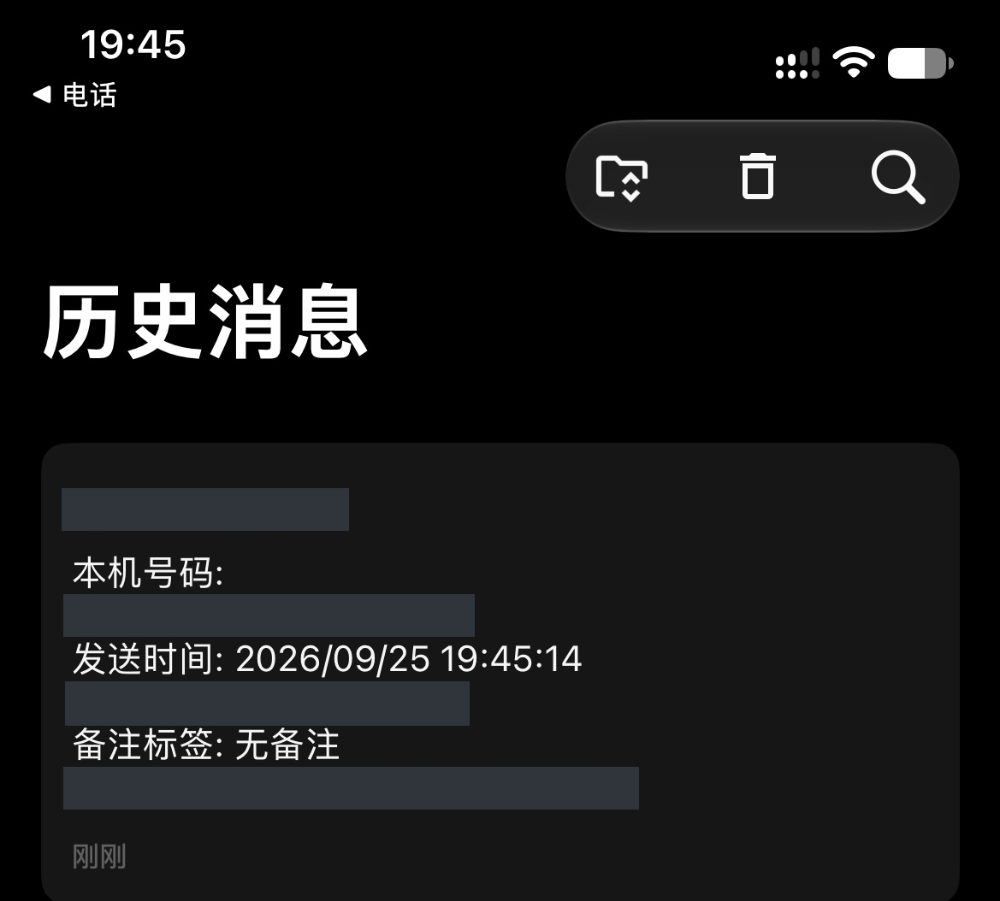

## 手机通过蜂窝网络接收

“外网推送测试”收到；设备仍使用家庭 Wi-Fi，不代表设备 4G 模式已经验证。

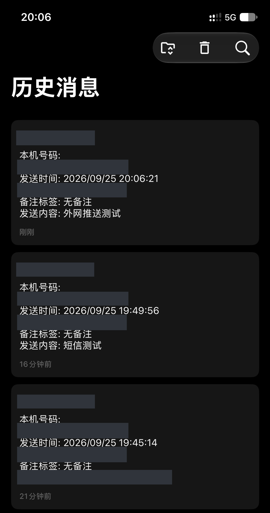

## 重启后接收

单次重启后短信转发成功，长期稳定性未据此验证。

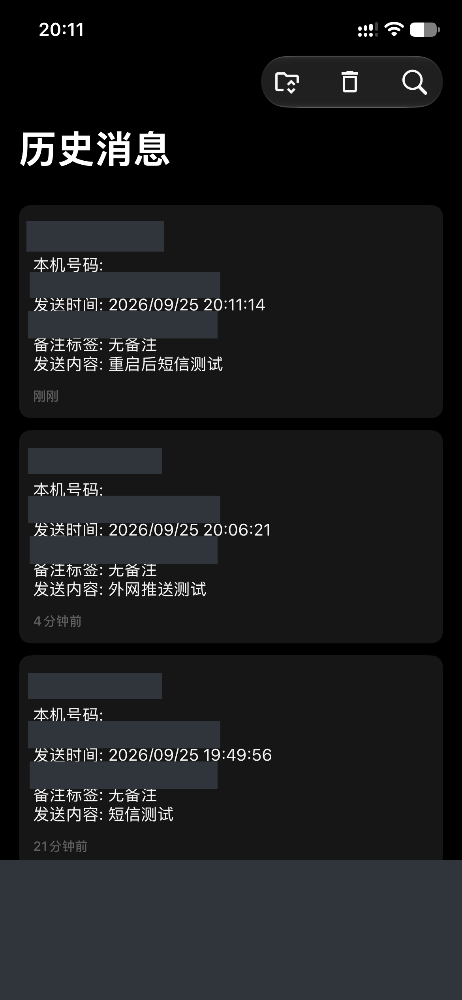

## Mac 串口联调对应的推送

与 Mac 串口测试相对应的 Bark 通知。Mac 助手临时截图尚待重新提供。

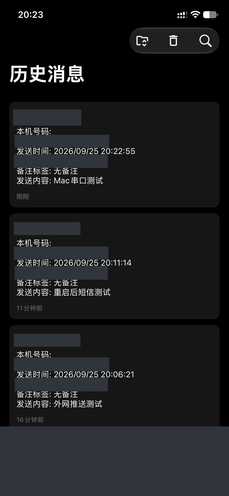

## 最新正文测试

收到“短信正文优先显示测试”，保留测试正文与时间用于对照。

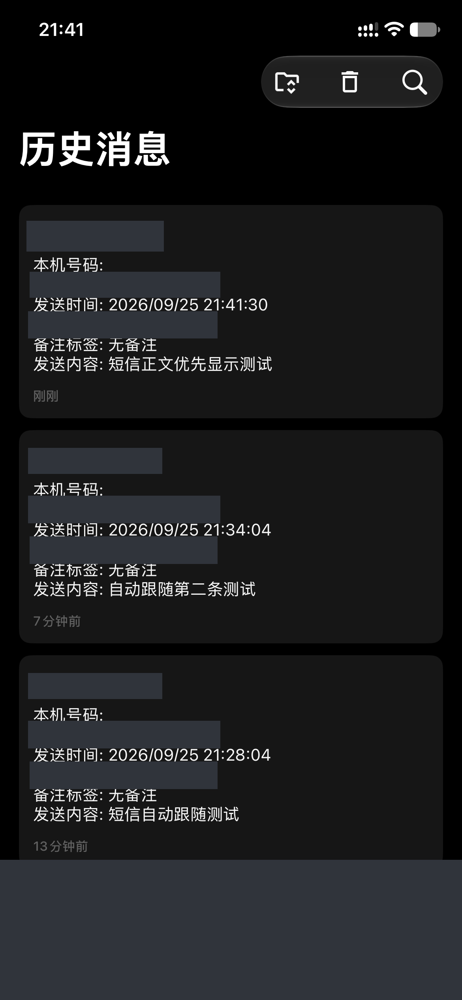

## 素材缺口

聊天中 Mac 串口助手截图使用 macOS 临时路径；本次没有找到对应文件，未纳入此次打码归档。包括 20:28:27、20:41:56、20:58:36、20:59:55、21:07:19、21:09:20、21:28:54、21:34:27、21:42:04、21:57:31 的截图。重新提供文件后需补做脱敏。

## 处理与复核

- 56 张图片重新编码为 RGB PNG，52 张加了遮盖，共 202 个区域；4 张未发现需要遮盖的私密内容，仅移除元数据。
- 使用本机 Vision OCR 定位，结合逐批图片预览补充区域；再次 OCR 未命中已检查的手机号、联系人及网络标识模式。OCR 不是绝对无遗漏的保证。
- 覆盖手机号、联系人、Wi-Fi 名称、MAC/BSSID、设备网络地址、密码输入值和无关通知。
- 保留测试短信正文、测试时间与操作界面；没有把真实结果换成模拟内容。
- 原图和含 PDU 的原始串口日志留在上级本地目录，不属于本分享包。
