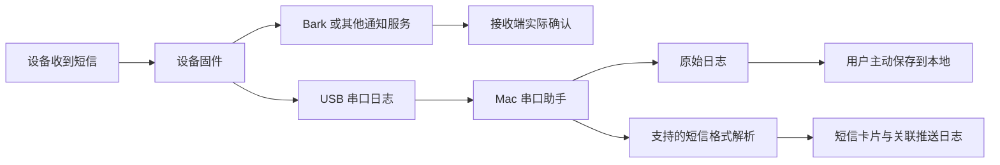

# 项目流程与边界

```mermaid
flowchart LR
 SIM[设备收到短信] --> FW[设备固件]
 FW --> PUSH[Bark 或其他通知服务]
 PUSH --> PHONE[接收端实际确认]
 FW --> USB[USB 串口日志]
 USB --> MAC[Mac 串口助手]
 MAC --> RAW[原始日志]
 MAC --> SMS[支持的短信格式解析]
 RAW --> SAVE[用户主动保存到本地]
 SMS --> CARD[短信卡片与关联推送日志]
```

Mac 不参与设备正常网络推送，也不会从 Bark 下载历史短信。结构化解析与推送关联有固件、编码及并发限制，见 README。发布流程：本地源代码 → 构建 → Developer ID 签名 → Apple 公证 → 作者验收 → 明确授权后公开 GitHub Releases。当前只到签名构建与私有归档。
